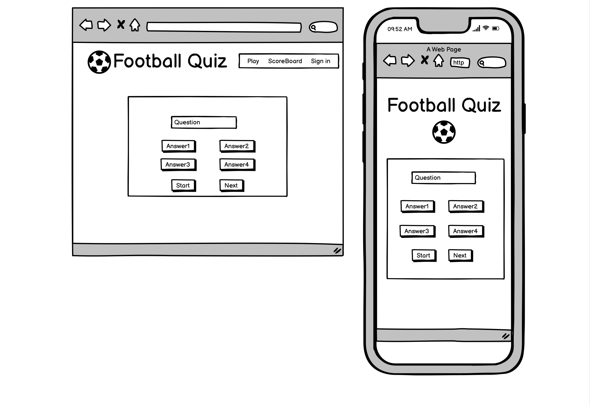

# Contents:

1. Introduction
2. UX
3. Features
4. Issues
5. Technologies
6. Testing
7. Deployment
8. Credits

# Test your football knowledge

## User Experience

### User Goals:

1. First time visitor:
    - easy navigation
    - for everyone who want to play a football quiz
    - score board and sign in option

2. Returning gamer
    - returning gamers who enjoyed the quiz
    - shuffeled question list
    - add new questions regulary

### Creator Goals:

1. User friendly online quiz
2. work on all device
3. place for fun

## Development Plans

I. Strategy:
II. Scope
III. Structure
IV. Skelton
#### Balsamiq wireframe for 2 different screen sizes

V. Surface

## Features

1. Existing features
2. Features to implement

## Issues

## Technologies

I. Languages :  
1. HTML5
2. CSS
3. Javascript

II. 
1. Font Awesome
    - football icon logo were taken from font awesome
2. Google fonts
    - google fonts were used to import Raleway font into style
3. Git
    - git was used for version control
4. Github
    - to store the project code
5. Wireframe
    - Balsamiq wireframes for different screen size
6. Coolores
    - to find colors from a wide selection
    [coolres](https://coolors.co/6f1d1b-bb9457-432818-99582a-ffe6a7)
7. Am I responsive
    - to see screen responsive design

## Testing

1. HTML validator
2. CSS validator
3. Screen responsive test

Used I am responsive site for test

## Deploying the project
    - the project was deployed and stored in Git
    - the source file was regulary pushed to repository Github
    - Published from Github repository to Github pages, which is in settings where need to scroll down to Github pages section, here look for source where is a label called none. Change none to master branch and save it.
    - Than the page will automatically refresh and the deployed link will be available.

## Credits
    - Pixabay: for the photos what was used for the website

[https://pixabay.com/]

