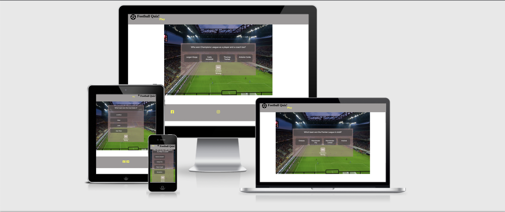
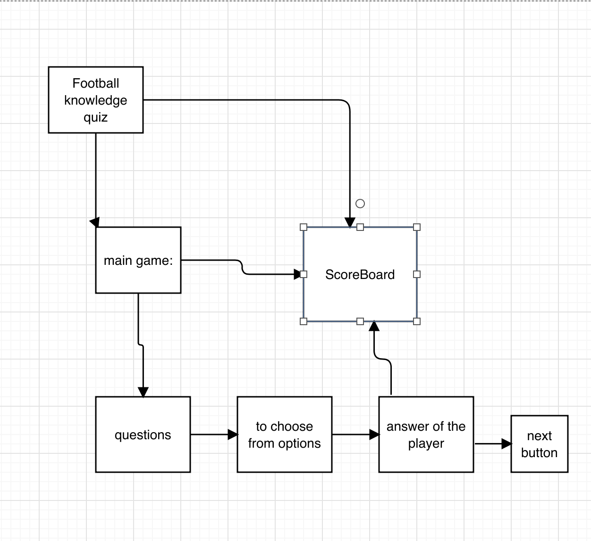
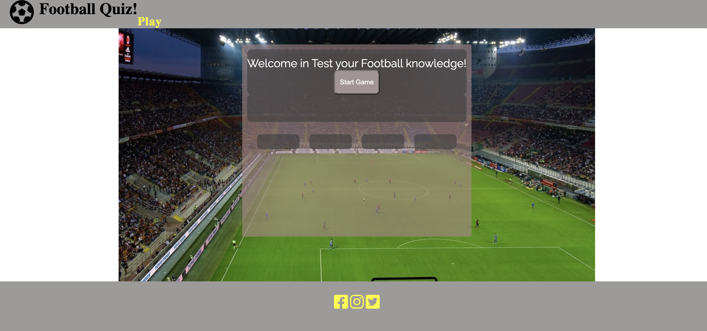
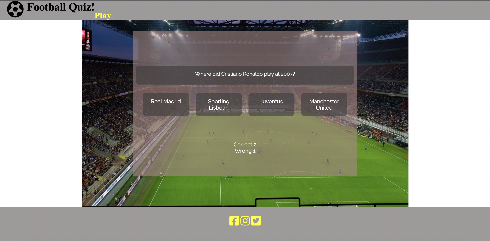
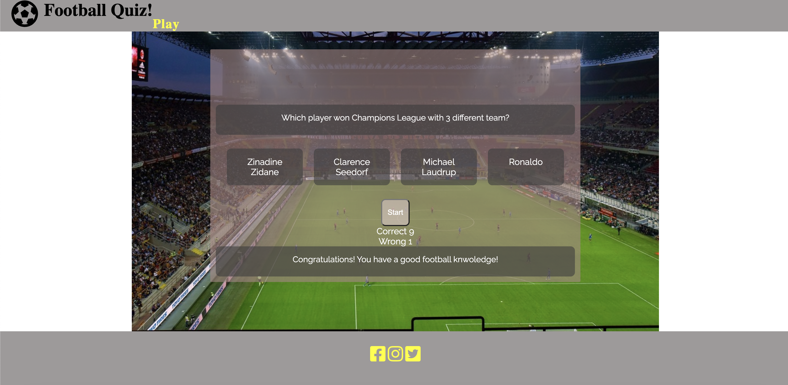

# Contents:

1. Introduction
2. UX
3. Features
4. Issues
5. Technologies
6. Testing
7. Deployment
8. Credits

# Test your football knowledge
Test your football knowledge is an online quiz game targeting everyone who likes football and quizgames.
The site will provide a quiz game, scoreboard and a sign in page.

## Introduction

[liveproject](https://balazs9.github.io/testyourfootballknowledge/)

## User Experience

### User Goals:

1. First time visitor:
    - easy navigation
    - for everyone who want to play a football quiz
    - score board and sign in option

2. Returning gamer
    - returning gamers who enjoyed the quiz
    - shuffeled question list
    - add new questions regulary

### Creator Goals:

1. User friendly online quiz
2. work on all device
3. place for fun

## Development Plans

### I. Strategy:
#### The focus of the quiz site:
    Target audience:
        - football funs
        - quiz funs
#### Demographics:
        - any age
#### Psyhographics:
        - people who want to play sports quiz
        - people who want to relax and enjoy a quiz on their break
### II. Scope

#### Requirements:

The player will be looking:

- a football quiz with fun

- with many questions

- learning facts

Functionality requrimenets:

- easy navigation

- links to social media

### III. Structure

#### The information of the quiz site was organized in a tree structure:

### IV. Skelton
#### Balsamiq wireframe for 2 different screen sizes

### V. Surface

- main colors what is used are: grey, white, yellow and red

- raleway font used with sans serif

## Features

1. Existing features

- opening page

- scoreboard, where is counting the correct and incorrect answers, giving feedback by showing in adding 1 to either Correct or Wrong answers. The game will show 10 questions in a random selections, without repeating them, after we gave 10 answers we will get to endgame.

- endgame where scores and a message is showing either is a winnig or a losing message, then we will get feedback, with either a congratulations message or a sorry.

2. Features to implement

- new game function after finishing the game, right now restart only works with the play button in navbar.

- player can give their name

- scoreboard to show the scores from players

## Issues

During the development what needed to be fixed:

- The game area was not responding as expected, after the questions and answers displayed the next question did not work. Searching for the problem in the code institue javascript concepts lesson, i found the Math.floor(Math.random) built in function, what was helping to schuffle my questions and i could iterate through questions.

- To stop the infinite game i used the splice method to remove the answered question from the array.

## Technologies

I. Languages :  
1. HTML5
2. CSS
3. Javascript

II. 
1. Font Awesome
    - football icon logo were taken from font awesome
2. Google fonts
    - google fonts were used to import Raleway font into style
3. Git
    - git was used for version control
4. Github
    - to store the project code
5. Wireframe
    - Balsamiq wireframes for different screen size
6. Coolores
    - to find colors from a wide selection
    [coolres](https://coolors.co/6f1d1b-bb9457-432818-99582a-ffe6a7)
7. Am I responsive
    - to see screen responsive design

## Testing

1. HTML validator

- index.html: no errors or warning

2. CSS validator

- style.css: no errors or warning

3. Screen responsive test

Used am I responsive site for test

## Deploying the project
    - the project was deployed and stored in Git
    - the source file was regulary pushed to repository Github
    - Published from Github repository to Github pages, which is in settings where need to scroll down to Github pages section, here look for source where is a label called none. Change none to master branch and save it.
    - Than the page will automatically refresh and the deployed link will be available.

## Credits
    - Pixabay: for the photos what was used for the website

[https://pixabay.com/]

